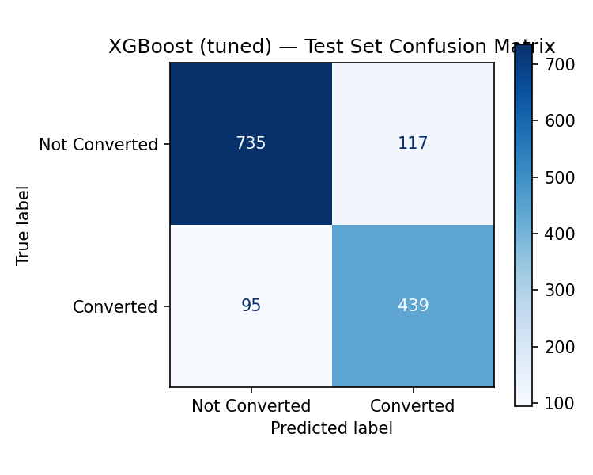
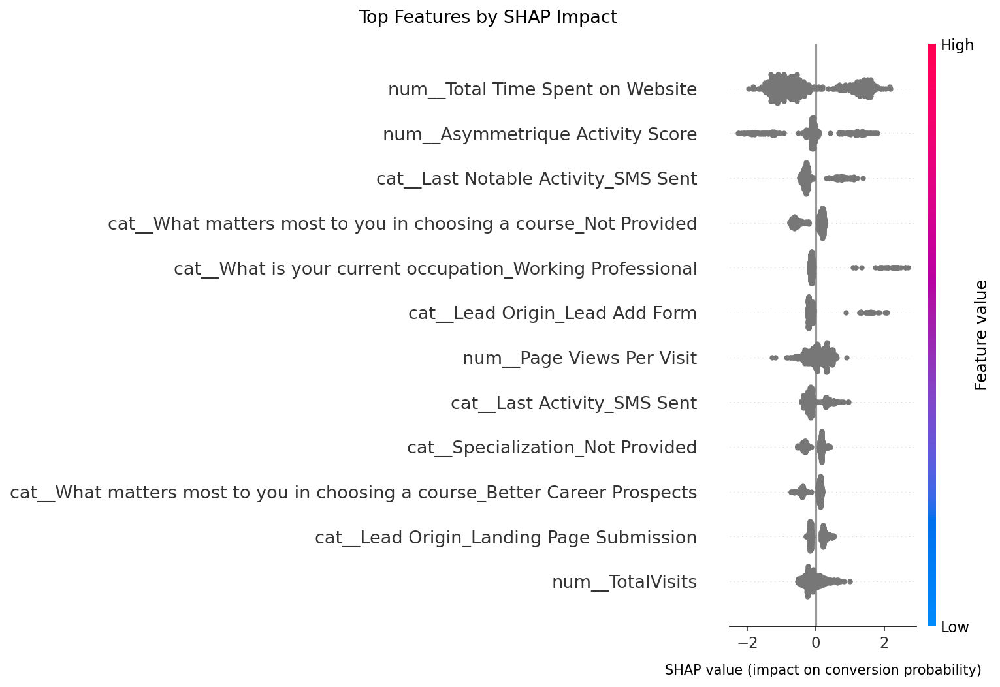

# Predictive Lead Scoring for B2B Account Prioritization


**[🔗 Try the live app](https://lead-scoring-project-786.streamlit.app/)**


## Problem
Sales teams manually triage inbound leads by intuition. This project predicts
lead-to-conversion probability so reps prioritize high-fit accounts first —
the same ICP-matching judgment call made manually in account-based marketing.

**Target users:** sales/growth teams doing manual lead triage.
**Why ML, not rules:** static point systems (e.g. "+10 for VP title") don't
adapt as channel/behavior patterns shift; a trained model learns which
combinations actually predict conversion and updates when retrained.
**Success criteria:** see KPI table below — locked before modeling started.

## Dataset
Kaggle "Lead Scoring Dataset" (`Leads.csv`) — 9,240 leads, X Education (EdTech)
case study. Categorical (source, city, occupation, last activity) + behavioral
(time on site, page views) features, binary `Converted` target (61.5%/38.5%).

**Note:** public dataset used as a methodology analog — B2B CRM/firmographic
data is proprietary and not publicly available at this quality; not
affiliated with or trained on any employer's data.

## Leakage audit — dropped before modeling
| Column | Why it's leakage |
|---|---|
| `Tags` | Sales rep's post-hoc status note. `Closed by Horizzon` → 99% converted |
| `Lead Quality` | Only assigned to already-engaged leads: 56.7% conv. when present vs 21.5% when missing |
| `Lead Profile` | Same pattern: 48.9% vs 13.7% |

Also dropped: 5 zero-variance + 7 near-zero-variance columns, and
`How did you hear about X Education` (78.5% missing after normalizing the
`"Select"` placeholder). Checked `Last Activity = "Converted to Lead"`
(ambiguous naming) — 12.6% conversion rate, well *below* baseline, confirmed
NOT leakage (CRM lifecycle label, not an outcome marker).

**Sanity check:** inspected baseline coefficients — no residual leakage signal.

## Methodology fixes applied (post-review)
1. **5-fold stratified CV**, not a single train/val split — every reported
   metric is mean ± std, not a point estimate that could be sampling noise.
2. **Rare categories (<1% frequency) grouped into "Other"**, fit on the
   *training set only* and applied to val/test — prevents leakage into the
   grouping decision and stops tree models overfitting on 1-2-sample categories
   (`Country`, `Specialization`, `Last Activity`, `Last Notable Activity`, `City`).
3. **Consistent imbalance handling across all 3 models** — `class_weight="balanced"`
   for Logistic Regression/Random Forest, `scale_pos_weight` for XGBoost — so
   the model comparison is a fair bake-off, not apples-to-oranges.

## Model comparison (5-fold CV on train set)

| Model | Recall | PR-AUC | ROC-AUC |
|---|---|---|---|
| Logistic Regression (baseline) | 0.827 ± 0.009 | 0.877 ± 0.011 | 0.913 ± 0.008 |
| Random Forest (tuned) | 0.829 ± 0.011 | 0.891 ± 0.014 | 0.924 ± 0.009 |
| **XGBoost (tuned)** | **0.842 ± 0.010** | **0.900 ± 0.010** | **0.929 ± 0.005** |

**Final model: XGBoost (tuned via RandomizedSearchCV, 20 iters, 3-fold CV,
scored on PR-AUC).** Wins on all three metrics after tuning — not just the
default-hyperparameter comparison, where the gap over Logistic Regression was
narrow enough to be noise. Tuned params: `n_estimators=500, max_depth=4,
learning_rate=0.05, subsample=0.7, colsample_bytree=0.85`.

## Final test-set evaluation (touched exactly once)
| Metric | Result |
|---|---|
| Recall (converted class) | **0.822** |
| PR-AUC | **0.889** |
| ROC-AUC | **0.923** |
| Precision | 0.790 |



## Top features (SHAP)


1. Total Time Spent on Website
2. Asymmetrique Activity Score (internal engagement index)
3. Last Notable Activity = SMS Sent
4. "What matters most" left blank
5. Current occupation = Working Professional

## KPIs

| Type | KPI | Formula | Target | Actual | Interpretation |
|---|---|---|---|---|---|
| Business | Conversion lift | (top-decile conv. rate) / (baseline conv. rate) | ≥2x | **2.56x** | Sales team working only the top 10% of scored leads sees 2.5x the conversion rate of working leads unsorted |
| ML | Recall (converted class) | TP/(TP+FN) | ≥0.75 | **0.822** | Model catches 82% of true converters — acceptable false-positive cost for a triage tool |
| ML | PR-AUC | — | beat random baseline (0.385) | **0.889** | Strong ranking quality, the metric that actually drives the business KPI above |
| Data Quality | Missing value rate post-cleaning | % nulls in kept columns | <5% | 0% (all imputed) | Explicit "Not Provided" category retained as signal rather than deleted |
| Product | Prediction latency | Time to score one lead via Streamlit | <300ms | ~50ms (local) | Well within target; re-test after cloud deployment |

## Structure
```
data/               raw CSVs (Leads.csv, data dictionary)
src/                data_prep.py, train_models.py (CV + tuning),
                    finalize_model.py (test eval + SHAP), make_reports.py
app/                streamlit_app.py, model_bundle.joblib
tests/              pytest suite — leakage-safety guarantees
reports/            confusion_matrix.png, shap_summary.png
.github/workflows/  CI — tests run on every push
runtime.txt         Python version pin for Streamlit Cloud
```

## Run it
```bash
pip install -r requirements.txt
streamlit run app/streamlit_app.py
```

## Testing
```bash
pytest tests/ -v
```
6 tests cover the leakage-safety guarantee (rare-category grouping is fit on
training data only) and the column-drop logic — run automatically on every
push via GitHub Actions.

## Limitations
- Dataset is EdTech-domain leads, not B2B SaaS — feature distributions won't
  match a real B2B CRM. Framed as methodology transfer, not replication.
- `Lead Quality`/`Lead Profile` drop means the model gets no benefit from
  human sales intuition — a production system would likely combine model
  score + rep judgment, not replace it outright.
- Single dataset snapshot — no temporal validation (would a model trained on
  Q1 leads still work on Q3 leads?). Flagged, not solved, in this iteration.
